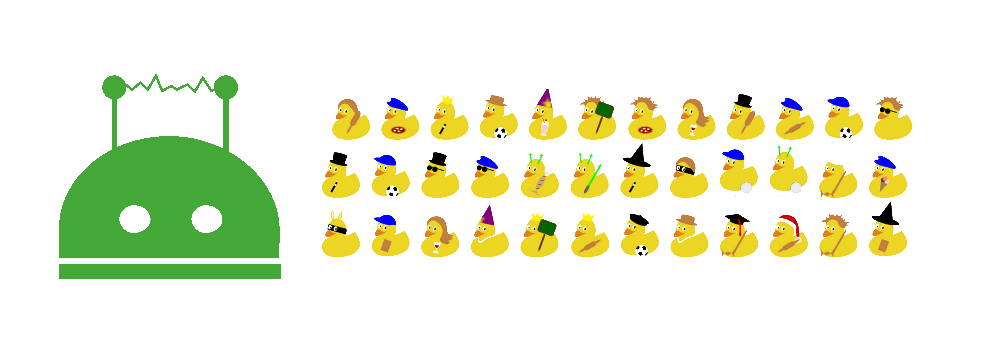

# wechaty-ducks-contrib

[](https://www.npmjs.com/package/wechaty-ducks-contrib)
[](https://github.com/wechaty/wechaty-ducks-contrib/actions?query=workflow%3ANPM)
[](https://github.com/huan/ducks#3-ducksify-extension-currying--api-interface)

Wechaty Ducks Contrib

[](https://github.com/wechaty/wechaty-ducks-contrib)

> Image Source: [TikZducks](https://www.ctan.org/pkg/tikzducks)

[](https://www.npmjs.com/package/wechaty-ducks-contrib)
[](https://www.typescriptlang.org/)

## What is Ducks

[](https://github.com/huan/ducks#3-ducksify-extension-currying--api-interface)

See [Ducks](https://github.com/huan/ducks)

## Usage

### Install

```sh
npm install wechaty-ducks-contrib
```

### Using Ducks with Wechaty Redux

```ts
import {
  WechatyRedux,
  api as wechatyApi,
}                     from 'wechaty-redux'
import { Wechaty }     from 'wechaty'
import { Ducks }       from 'ducks'

const bot = Wechaty.instance({ puppet: 'wechaty-puppet-mock' })

const ducks       = new Ducks({ wechaty: wechatyApi })
const store       = ducks.configureStore()
const wechatyDuck = ducks.ducksify('wechaty')

bot.use(WechatyRedux({ store }))

store.subscribe(() => console.info(store.getState()))
store.dispatch(wechatyDuck.actions.ding('redux!'))
```

## Ducks References

### 1 Counter

```ts
import { Counter } from 'wechaty-ducks-contrib'
import { Ducks }       from 'ducks'

const ducks = new Ducks({ counter: Counter })
const counterDuck = ducks.ducksify('counter')

console.info(counterDuck.selectors.getMo())
```

#### 1.1 `selectors`

1. `getMo()`: Get Mobile Originated messages counter number
1. `getMt()`: Get Mobile Terminated messages counter number

Example:

```ts
Counter.selectors.getMo(store.getState().counter)()
// or using Ducksified API:
counterDuck.selectors.getMo()
```

## History

### master

### v0.0.1 (Jun 2, 2020)

[](https://github.com/huan/ducks#3-ducksify-extension-currying--api-interface)

Initial version.

1. Requires `wechaty@0.40` or above versions.
1. Requires `wechaty-redux` Plugin.
1. API follows the [Ducks](https://github.com/huan/ducks#readme) specification.

## Author

[Huan LI](https://github.com/huan) ([李卓桓](http://linkedin.com/in/zixia)) zixia@zixia.net

[](https://stackexchange.com/users/265499)

## Copyright & License

- Code & Docs © 2020 Huan (李卓桓) \<zixia@zixia.net\>
- Code released under the Apache-2.0 License
- Docs released under Creative Commons
